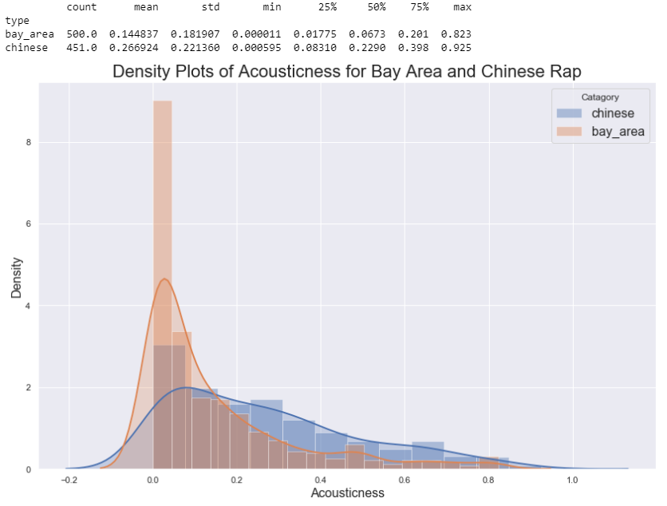
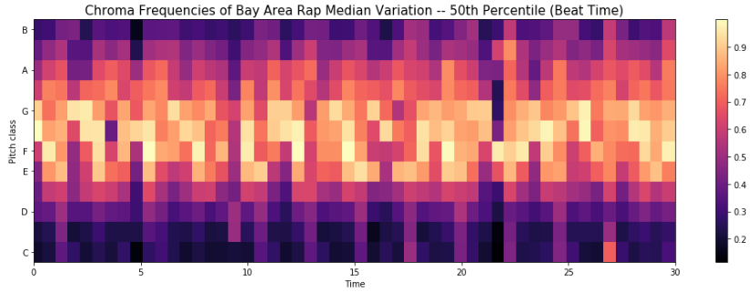

# Cultural Analytics of Chinese and Bay Area Rap

DSC160 Data Science and the Arts - Midterm Project Repository - Spring 2020

Project Team Members: 
- Kevin Elkin, kelkin@ucsd.edu
- Liam McCarthy, lamccart@ucsd.edu
- Umang Saraf, usaraf@ucsd.edu
- Charul Sharma, c4sharma@ucsd.edu
- Karan Sunil, ksunil@ucsd.edu

## Abstract

For the project proposal, please write a short abstact addressing the questions below. You should replace the entire contents of this section with one to two paragraphs addressing the following:

In America, looking at the Billboard Hot 100 at any given time will reveal an overwhelming majority of  artists that are from America (or at least from the Western hemisphere). However, with the increased ease of information flow across continents, America has been exposed to and finally embraced Eastern cultures of music. From labels like 88Rising creating a label based solely around artists with Asian cultural influences, to the phenomenons of K-Pop and J-Pop, the songs getting millions of plays are no longer solely from Western artists. In our project, we are going to study the differences and similarities between the music of popular Eastern and Western artists, specifically in the genre of hip hop/rap. The data set we are going to analyze will be audio scraped and sampled from YouTube and contain modern-day artists from both the East and the West. Our data will be in the form of mp3 files similar to the ones analyzed in Exercise 2 using Librosa. 

The research question we will be attempting to answer is, just how different or similar are the eastern and western cultures of music? Are certain artists we view as completely different (i.e. K-Pop, hip hop, and Atlanta rap) somewhat sonically similar or are the Western influences more closely related to each other than to Eastern influences? Our hypothesis is that the modern day evolution of these cultures of music has led to distinct similarities in certain features while other features remain wildly diverse between eastern and western artists.

We will be using the mel frequency cepstral coefficients (MFCCs) as features to train our model, allowing us to describe the overall shape of a spectral envelope. Additionally, we will look to do EDA to further explore potential differences and similarities between the music types we have selected; this will allow for further feature creation and model performance. 

We will likely use a variety of analytical techniques to build our model including creating a training, testing, and validation dataset to accurately create a model that is suitable to use on unseen data. In addition to this we will likely use a variety of different models to test on such as SVM, Neural Networks (MLPClassifier, Keras Sequential classifier), Random Forest, Logistic Regression, etc. We will assess our model based on accuracy, and a Confusion Matrix. 

Our results will consist of models that will be used to predict that type of song. The performance of the model will be depicted through numbers, different graphs and charts and other visualization that best explains our findings. We would then study which features were more or less useful in differentiation of eastern and western music, using that information to find what similarities and differences the two styles have.

We will be using coarse and audio features for our project. We will obtain our coarse features from the spotify API. We will consider the following features - accousticness, dancability, duration (ms), energy, instrumentalness, key, liveness, loudness, mode, speechiness, tempo, time signature, valence. This would allow us to get an overview of the entire song and allows us to compare songs across the classes. Using 30 second previews of songs that we got from the Spotify API we will calculate the MFCC’s, chroma frequencies and spectoral centroid. This will gave us an understanding of the sound, feel and style of the song.

As the world’s rate of information exchange increased dramatically and we edge closer and closer to a global culture, it is interesting to study just how close we have already become. “East” and “west” are the primary binary used in describing global culture, and as these separations dissolve, humanity takes a leap towards unity. Music is often a defining trait of a culture, and its exchange is a defining characteristic of two cultures coming closer together. 

## Data

Our dataset was collected using the Spotify API. The data set was generated based on two different Genres, Chinese Hip Hop artists and Bay Area Hip Hop artists. Artists from Bay Area included Young A.Z., Jon Nash, Big Cholo etc. and artists from China included Straight Fire Gang, 謝帝, Lil Ghost小鬼, Machi DIDI etc. We were able to extract 86 artists that represented Bay area Hip hop and 110 artists that represented Chinese Hip hop.

We collected the top songs for each of the artists based on spotify's algorithm for top songs. The songs in our dataset were created between 1999-2020 but a majority of the songs were created in the past 3 years. Over 60% of all the songs in our dataset were created after 2016 
  

The songs in our dataset were created by either hip hop artists from China or Bay Area, California.  We created two different datasets, one was in native form and the other was in .mp3 format. Spotify had a feature which enabled us to query the features of each song which was saved in [Spotify_data](https://github.com/ucsd-dsc-arts/dsc160-midterm-group7/blob/master/data/Spotify_data.csv). In addition to this, we also downloaded the preview URL of each of these songs. The file containing all the downloaded songs was too big in size for github so instead we added songs from 2 different artists in the test-music-data directory for testing purposes. 

## Code

### Data acquisition/scraping
[ELT](https://github.com/ucsd-dsc-arts/dsc160-midterm-group7/blob/master/code/ELT.py)- `Conatains library code for the data extraction process`

[Data-extraction](https://github.com/ucsd-dsc-arts/dsc160-midterm-group7/blob/master/code/Data-extraction.ipynb)- `Conatins code to extarct artists, tracks, audio features and dowload songs of each artist.`

To collect the data for the Bay area hip hop artists and Chinese Hip hop artists we made use of the spotipy library, a lightweight python API for Spotify. The spotipy library contained a search features that allowed us to query from their  database based on Genre, location and type. Once we created a list of artists we were using for our analysis, we queried the Top 10 tracks for each of these artists using Spotipy's top_tracks_artists function. Each track accompanied some meta data such as data released, duration etc., a preview URL 30 seconds long and URI which was a unique indicator for the track. The preview URL of each of these tracks was downloaded and saved to a directory based on genre (bay area hip hop or chinese hip hop) and artist name. The URI was then used to extract features for each track. The spotipy library contained a function that returned broad features of each song such as speechiness, danceability, energy, acousticness and 13 other features. All these features and some other meta data extracted from each track were saved in a dataframe with the artist's name, song URI and type of artist. 

### Preprocessing and Analysis
[Spotify Preprocessing & Spotify Analysis](https://github.com/ucsd-dsc-arts/dsc160-midterm-group7/blob/master/code/Coarse_EDA.ipynb) - `Contains code to preprocess, analyze and generate results based on the coarse track features found by the Spotify API.`

After the Spotify data was collected, we began to clean and preprocess the data. The data was first quickly examined by creating a joint plot matrix that allowed us to see the differences and similarities of different coarse audio features acquired by the Spotify API. Upon closer inspection we were able to understand the similarities and differences between Chinese and Bay Area Rap. Additionally, we could see what features were correlated with one another; this led us to further investigate the differences between Chinese and Bay Area Rap. 

The data was preprocessed by eliminating the features that we saw as "useless" to our analysis for coarse audio features. These columns included the id, URI, and analysis_url. We labeled each song (509 songs per category) as bay_area or china and kept the name of the song and artist to later go back and identify songs of interest. 

The most interesting features that had differences between Chinese and Bay Area Rap included acousticness, tempo, and speechiness. These features were later analyzed using bivariate KDE plots (explained in results and discussion) as well as density plots to represent the similarities and differences between the two styles of rap. 

[Audio Preprocessing & Audio Analysis](https://github.com/ucsd-dsc-arts/dsc160-midterm-group7/blob/master/code/Audio_EDA.ipynb) - `Contains code to preprocess, analyze and generate results based on the audio features of the 30 second preview tracks found by the Spotify API.`

This notebook aimed to analyze the Spotify preview audio for each song (30 seconds per song). This notebook was intended to generalize each category’s key audio styles and sounds by providing an in depth look into features and graphs such as Waveforms, MFCC, Mel-frequency Spectrograms, Spectral Centroid, and Chroma Frequencies. 

We decided to choose 3 songs from each category to further analyze; these songs were chosen based on variation presented from taking the mean of each MFCC. To further explain this, we computed the MFCC for each song (1018 songs total) and then obtained the mean of each coefficient. Next we computed the variance among all 12 MFCC and sorted the list. We chose the 95th Percentile, 50th Percentile (Median), and 5th Percentile to represent High, Medium, and Low variations respectively. 

We then closely analyzed the Waveforms, MFCC, Mel-frequency Spectrograms, Spectral Centroid, and Chroma Frequencies among all six of these songs. In addition to this, we also analyzed the average pitch energy present in each song from each of the semitones (Chroma Frequencies). This was intended to provide insight as to what semitones each category of songs (China/Bay Area) incorporate. 

General notes: For both notebooks you will need to make use of the DSMLP server and have roughly 40-50 GB of RAM (I ran my notebooks using 55 GB of memory, 4 CPU, and 0 GPU). Much of the data cleaning can take up to 2 hours to complete across the entirety of the dataset. These files will then be exported to a csv, npy, json, etc. so they will not need to be completed later. Additionally, some of the models (especially the model using keras) will need to create the MFCC's for each of the 1018 songs which can take anywhere form 30-45 minutes to complete. Many (if not most) of the dataframes, dictionaries, and matrices were exported to another file and then read in later on to avoid having to rerun code that was computationally expensive to run. These files will be found in our GitHub and in the notebooks. To make viewing and grading our code easier, all cells have been run with appropriate output prior to being added to GitHub. 

### Generating Results and Model Classification

In both notebooks we decided to examine how well our features would perform on a variety of models. For the course audio features, we used SVM, Logistic Regression, Random Forest Classifier, and MLP classifier to asses model performance on all the useful features and the three features with the largest variation (acousticness, tempo, speechiness). 

For the Audio features we used the MFCC's of all the song previews and feed that into a neural network in keras to try and classify the songs based on the MFCC's alone. The notebooks show the effectiveness of various models and features at the end titled "Model Creation". We can see the advantages and disadvantages of using solely coarse audio features (quicker runtime, slightly less accuracy) and using MFCC (longer runtime, better accuracy). 

## Results

This section will contain links to documentation of your results. This can include figures, sound files, videos, bitmaps, as appropriate to your domain of analysis. Each result should include a brief textual description, and all should be listed below: 

- image files (`.jpg`, `.png` or whatever else is appropriate)
- audio files (`.wav`, `.mp3`)
- written text as `.pdf`

 
 
 
 
 
 
 
 
 
 
 
 
 
 
 
 
 

 
 ### Tracks with High, Medium, and low Variation of China and Bay Area Rap
 
[Goon.mp4 - Bay Area High Variation 95th Percentile](Song_Variation_MFCC/Goon.mp4)

[In My Hood.mp4 - Bay Area Median Variation 50th Percentile](Song_Variation_MFCC/In_My_Hood.mp4)

[I'm a Gunner.mp4 - Bay Area Low Variation 5th Percentile](Song_Variation_MFCC/I'm_a_Gunner.mp4)

[隻手遮天.mp4 - China High Variation 95th Percentile](Song_Variation_MFCC/隻手遮天.mp4)

[Know My Style (feat. 艾福傑尼 & 黃旭) - Gizzle Remix.mp4 - China Median Variation 50th Percentile](Song_Variation_MFCC/Know_My_Style_Gizzle_Remix.mp4)

[Life Is Beautiful.mp4 - China Low Variation 5th Percentile](Song_Variation_MFCC/Life_Is_Beautiful.mp4)
 
 
 
 
 
 
 
 
 
 
 
 
 
 
 
 
 
 
 
 
 
 
 
 

## Discussion

(30 points, three to five paragraphs)

The first paragraph should be a short summary describing your results.

As eastern and western cultures blend, it is interesting to see how they retain differences while growing together. Globalization has been a huge factor in culture for the last few decades, and music is no exception; styles like rap and hip hop continue to permeate cultures in countries big and small. However, countries remain influenced by their own factors, and even as genres enter new countries, they are influenced by the countries’ own individual cultural norms.

Thus, studying music as it evolves in different countries is a key to understanding the countries’ evolutions themselves; music is a key signifier of culture, and countries with similar music will have similar cultures. The correlation of music to culture can be seen at a smaller scale in the rural southern United States: the region is unified by country music, and these regions share a more similar culture to each other than to more metropolitan areas. Ancient cultures each developed their own unique music, indicative of unique cultures; it then follows that as cultures become more similar, their music follows.

Our current audio features are calculated on a 30 second preview of the song. This clip of the song is not completely representative of the entire song, more often than not this just including the song’s catchiest part. Using the full song to calculate audio features would help in improving our classification, and remove any bias created. Further, it would be interesting to analyse the lyrics of these songs. Using natural language processing we could understand the similarities and differences between these two different genres of music. It would be interesting to see if they sing about similar topics. This would require us to translate the chinese lyrics to English or vice versa, which can be quite a tricky task.

It would be interesting, as well, to track these similarities and differences over time. As we track how they evolve in tandem to the cultures of the countries where they are evolving, finding merit in or disproving the theory that a culture’s evolution can be tracked by its music.

## Team Roles

Provide an account of individual members and their efforts/contributions to the specific tasks you accomplished.

- Umang Saraf

I had the task of setting up the Spotify API to work with python and to create the dataset. I wrote the scrpits to extract all artists representing the 2 different Genres in study, get the songs for each artis and then download the preview of the song and extract audio features for each of the song.

- Kevin Elkin
- Liam McCarthy

- Charul Sharma
- Karan Sunil

## Technical Notes and Dependencies

Any implementation details or notes we need to repeat your work. 
- Additional libraries you are using for this project

  - Spotipy
  - urllib
  - pandas
  - keras
  - seaborn 

- Does this code require other pip packages, software, etc?

  To run the code you need to obatin a credentials to use the spotify API from their developers website.

- Does this code need to run on some other (non-datahub) platform? (CoLab, etc.)
  
  Datahub will be sufficient as long as adequate resources (memory, CPU, etc) are allocated to running the code
  
## Reference

References to any papers, techniques, repositories you used:
- Papers

- Repositories
  - https://github.com/plamere/spotipy
  - https://musicinformationretrieval.com/index.html

- Blog posts
  - https://medium.com/@maxtingle/getting-started-with-spotifys-api-spotipy-197c3dc6353b
  
- Other
  - https://librosa.github.io/librosa/generated/librosa.feature.chroma_stft.html
  - https://en.wikipedia.org/wiki/Chroma_feature
  - https://keras.io/guides/sequential_model/
